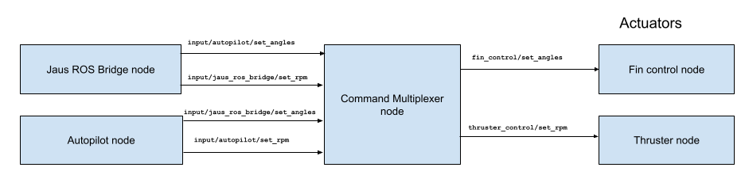

## `Command Actuator Multiplexer` node
A multiplexer for command thruster velocity and fins inputs. It arbitrates incoming messages from the Jaus ROS bridge and autopilot, allowing one node at a time to command the actuator, based on priorities.
It also deactivate the current allowed topic if no messages are received after a configured timeout. All topics, together with their priority and timeout are configured through a YAML file.

### Subscribed Topics

*/input/autopilot/set_angles* ([fin_control/SetAngles](../fin_control/msg/SetAngles.msg): Receives from the `autopilot` node the fins angle position.

*/input/autopilot/set_rpm* ([thruster_control/SetRPM](../thruster_control/msg/SetRPM.msg): Receives from the `autopilot` node the Thruster velocity.

*/input/jaus_ros_bridge/set_angles* ([fin_control/SetAngles](../fin_control/msg/SetAngles.msg): Receives from the `jaus_ros_bridge` node the fins angle positions.

*/input/jaus_ros_bridge/set_rpm* ([thruster_control/SetRPM](../thruster_control/msg/SetRPM.msg): Receives from the `jaus_ros_bridge` node the Thruster velocity.

### Published Topics

*/fin_control/set_angles* ([fin_control/SetAngles](../fin_control/msg/SetAngles.msg): Fins' angle positions command, subscribed by the [fin_control](../fin_control/README.md) node.

*/thruster_control/set_rpm* ([thruster_control/SetRPM](../thruster_control/msg/SetRPM.msg): Thruster's velocity command, subscribed by the [fin_control](../fin_control/README.md) node.

*/CmdActuatorMuxNodelet/fin_angle_active* ([std_msgs/String](https://docs.ros.org/en/api/std_msgs/html/msg/String.html): Indicates which fins angle input is active.

*/CmdActuatorMuxNodelet/set_rpm_active*  ([std_msgs/String](https://docs.ros.org/en/api/std_msgs/html/msg/String.html): Indicates which thruster velocity input is active.

## Configuration
The configuration of the _Command Multiplexer_ is provided as a [YAML file](param/actuator_mux.yaml).
