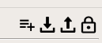
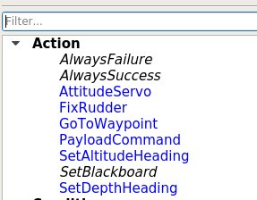

# Groot

This document explains how to install and use [Groot](https://github.com/BehaviorTree/Groot).

## Features
Groot is a Graphical Editor, written in C++ and Qt, to build and inspect behavior trees.
It is compliant with the the [BehaviorTree.CPP](https://github.com/BehaviorTree/BehaviorTree.CPP) library. 

The next behaviors/actions were implemented as tree node model (Groot Palette)
- Abort
- Attitude Servo
- Fix Rudder
- Go To Waypoint
- Payload Command
- Set Altitude Heading
- Set Depth Heading


## Installation

### As a ROS package
The instructions to install Groot as a ROS package can be found [here](https://github.com/BehaviorTree/Groot#compilation-instructions-ros).

The application can then be run using:
```sh
rosrun groot Groot
```

### On a Windows workstation

Instructions to a standalone Groot installation on Windows can be found [here](https://github.com/BehaviorTree/Groot/blob/master/qt_installer_howto.md).

## Instructions

### Creating new Missions

For creating mission with the custom behaviors, the tree node model must be loaded.

- Load the Tree Node Model to get the custom behavior/actions from the toolbar:  

- Select the icon to load a pallette. The palette can be found in the [mission control package](https://github.com/ChrisScianna/ROS-Underwater-RnD/tree/master/mission_control/groot_palette)
- Now the behaviors are displayed on the tree Node Palette.

- Draw the mission. Drag and drop nodes and connect them.
- Save the mission.
- The documentation of behavior Tree can be found [here](https://www.behaviortree.dev/).  

Once you have created the mission, it's not necessary load the palette in order to load the mission. Groot saves the tree node model in the saved file.  

## Useful Links
- [Behavior Tree Documentation and Tutorials](https://www.behaviortree.dev/)
- [Groot Github project](https://github.com/BehaviorTree/Groot/)
- [Behavior Tree Github project](https://github.com/BehaviorTree/)
- [Demo](https://robmosys.eu/wiki-sn-03/community:behavior-tree-demo:start)